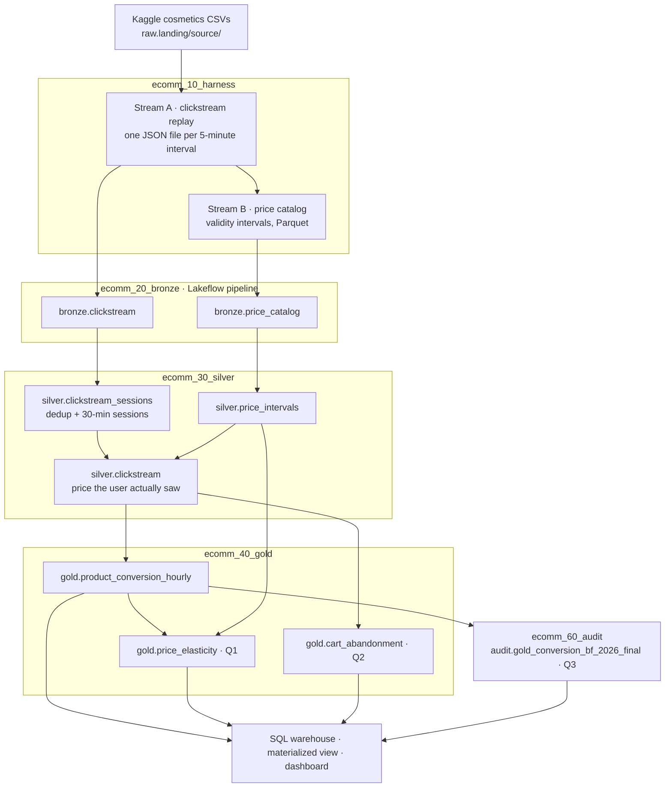
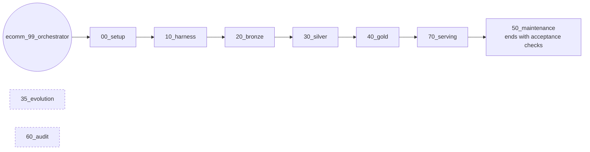

# Architecture

How the ECOMM clickstream exam is built on Databricks Free Edition: the data flow,
the jobs that run it, where every object lives, and how the code is organised.
The reasoning behind each choice is in [decisions.md](decisions.md).

## 1 · Data flow

The exam brief ("E-Commerce Clickstream & Dynamic Pricing Elasticity") asks three questions:

- **Q1:** price elasticity after a price drop of more than 15%.
- **Q2:** lost revenue from carts abandoned after a price increase.
- **Q3:** an immutable Black Friday snapshot that survives later writes.

Everything below exists to answer those three.



| Stage | Built in phase | Status |
|---|---|---|
| Setup, source landing, harness | 1–2 | built |
| Bronze Lakeflow pipeline | 3 | built |
| Silver: dedup, sessions, temporal join | 4 | built |
| Evolution demo | 5 | built (manual job) |
| Gold: funnel, Q1, Q2 | 6 | built |
| Maintenance and acceptance checks; Q3 audit | 7 | built (audit is a manual job) |
| Serving: statistics, materialized view, three-way benchmark | 8 | built |
| AI/BI dashboard | 8b | after the first run: its SQL has to be tested against real tables first |

## 2 · Jobs and orchestration

**Each layer is its own Lakeflow job.** A layer can be run, retried or scheduled on its own.
`ecomm_99_orchestrator` only decides the order, using one `run_job_task` per layer.



Serving runs before maintenance on purpose: maintenance ends with the acceptance checks,
which have to see every layer's evidence, A12 from serving included.

| Job | Tasks | Triggered by |
|---|---|---|
| `ecomm_00_setup` | `setup` → `land_source` | orchestrator |
| `ecomm_10_harness` | `harness_clickstream` → `harness_price_catalog` | orchestrator |
| `ecomm_20_bronze` | `ingest` (Lakeflow pipeline update) → `verify_bronze` | orchestrator |
| `ecomm_30_silver` | `sessionize` ∥ `price_intervals` → `temporal_join` | orchestrator |
| `ecomm_40_gold` | `conversion_hourly` ∥ `q1_elasticity` ∥ `q2_abandonment` | orchestrator |
| `ecomm_70_serving` | `statistics` ∥ `materialized_view` → `three_way` | orchestrator |
| `ecomm_50_maintenance` | `optimize` ∥ `history_guard` → `acceptance_checks` | orchestrator (last) |
| `ecomm_35_evolution` | `evolve` | manual: after silver exists |
| `ecomm_60_audit` | `freeze` → `immutability_proof` → `retention_check` | manual: after gold exists |

`∥` = runs in parallel.

**Parameters** reach every notebook as widgets:

| Parameter | Meaning |
|---|---|
| `catalog` | the Unity Catalog catalog to use (bundle variable, default `exam_ecommerce`) |
| `run_id` | the layer job's own run id (`{{job.run_id}}`) |
| `orchestration_run_id` | the orchestrator's run id, so all layers of one end-to-end run can be joined |

**Compute** is serverless everywhere. A task with no cluster block runs on serverless.
Free Edition allows 5 concurrent tasks, and this design peaks at 3: the orchestrator's
task plus 2 parallel tasks in one layer job.

## 3 · Unity Catalog layout

```
exam_ecommerce                         catalog (bundle variable `catalog`)
├── raw
│   └── landing                        volume: files, not tables
│       ├── source/cosmetics/          the 5 Kaggle CSVs
│       ├── clickstream/dt=/hh=/min5=/ Stream A micro-batches (JSON)
│       └── price_catalog/             Stream B intervals (Parquet)
├── bronze                             Lakeflow streaming tables
├── silver                             cleaned, sessionized, price-bound
├── gold                               Q1 / Q2 aggregates
├── audit                              frozen Q3 copies
└── ops
    └── measurements                   the evidence pack
```

The notebook `01_create_uc_objects` creates these objects, not the bundle. That way,
`bundle destroy` can never drop a schema with data in it (decision D-04).

## 4 · Code layout

```
databricks/
├── databricks.yml               bundle: name, `catalog` + `warehouse_id` variables, `dev` target
├── resources/
│   ├── jobs/                    one YAML per job: ecomm_NN_<layer>.job.yml
│   └── pipelines/               the bronze Lakeflow pipeline
├── src/
│   ├── ecomm/                   the library: all logic lives here
│   │   ├── settings.py          defended thresholds (noise, windows, floors)
│   │   ├── project.py           catalog / schema / table / volume naming
│   │   ├── tables.py            the data model: DDL of every notebook-written table
│   │   ├── history.py           retention policy + guard (never shorten history)
│   │   ├── quality.py           pipeline expectations (data-quality rules)
│   │   ├── evidence.py          ops.measurements recorder
│   │   ├── acceptance.py        the brief's criteria A1–A12 and which notebook proves each
│   │   ├── perf.py              plans, timings and skew without a Spark UI
│   │   ├── audit.py             Q3: frozen-copy provenance and the proof's readings
│   │   ├── serving.py           the category-by-day question and its materialized view
│   │   ├── warehouse.py         run SQL on the SQL warehouse via the SDK; read its metrics
│   │   ├── runtime.py           notebook bootstrap (parameters, time zone, evidence)
│   │   ├── schemas.py           shared Spark schemas
│   │   └── transforms/          pure DataFrame functions: harness, bronze, silver, gold
│   ├── pipelines/bronze/        Lakeflow pipeline source, one file per streaming table
│   ├── notebooks/               thin: parameters → library call → write → evidence
│   │   ├── 00_setup/  10_harness/  20_bronze/  30_silver/  35_evolution/
│   │   └── 40_gold/  50_maintenance/  60_audit/  70_serving/
│   └── sql/reports/             Q1, Q2, Q3 for the SQL editor (named parameters)
├── tests/
│   ├── unit/                    fast, local Spark, hand-built inputs (pytest)
│   └── parity/                  harness → silver → gold on the full data vs the AWS numbers
└── docs/                        this file and decisions.md
```

**Rule of thumb:** a notebook decides *what* runs and records *what happened*. The
library in `src/ecomm` decides *how*. Business logic never lives in a notebook cell,
so it can be unit-tested without a workspace.

### Anatomy of a notebook

Every notebook follows the same shape, so any one of them can be read cold during a demo:

1. **Header card:** job → task, what it reads, what it writes, which part of the brief
   it answers, and which Databricks concepts it shows.
2. **Setup:** put `src/` on the import path, call `bootstrap()`, read job-specific widgets.
3. **Numbered steps:** each has a short markdown cell explaining *why*, then the code.
4. **Verify and record evidence:** measure what actually landed, `ev.record(...)`, `ev.flush()`.
   Assertions that guard acceptance criteria come last, so the evidence is written even
   when an assertion fails.

## 5 · Conventions

| Thing | Convention | Example |
|---|---|---|
| Job | `ecomm_<NN>_<layer>`; NN gives the run order | `ecomm_10_harness` |
| Task key | `<verb/noun>` in snake_case | `harness_clickstream` |
| Notebook | `<NN>_<what_it_does>.py` inside its layer folder | `10_harness/01_clickstream_replay.py` |
| Table | `<catalog>.<layer>.<entity>` | `exam_ecommerce.silver.clickstream` |
| Money | `DECIMAL(12,2)` from silver on; integer cents inside calculations | |
| Time | session time zone pinned to UTC in `bootstrap()` | |
| History | table retention comes only from `ecomm.history`; never shortened (D-09) | |

## 6 · Serverless constraints that shaped the code

| Constraint (Free Edition, serverless) | Consequence in the code |
|---|---|
| `df.cache()` / `persist()` raise | nothing is cached; expensive intermediates become Delta tables |
| no `sparkContext`, RDDs or `_jdf` (Spark Connect) | plans come from `df.explain(mode="formatted")`; no JVM access |
| only 6 Spark confs can be set, and an unsupported conf fails a job | join strategy is chosen with hints (`broadcast`, `RANGE_JOIN`), not confs |
| no Spark UI | performance evidence comes from the query profile and data-level skew measurements |
| `input_file_name()` unsupported on Unity Catalog | `_metadata.file_path` |
| outbound internet limited to trusted domains | source landing falls back to a volume upload |
